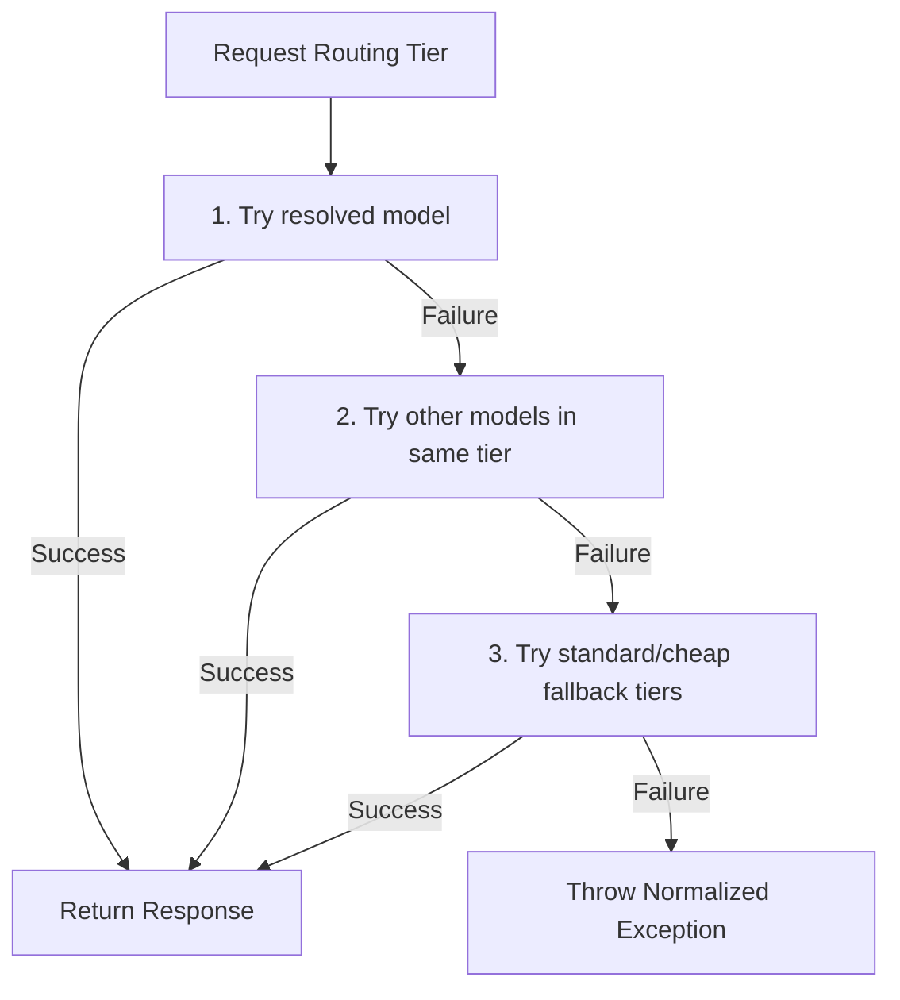

# Fallback and Resilience Logic

TokenShield AI Gateway utilizes robust .NET resilience patterns to guarantee high availability and model provider failover capability.

---

## 1. Transient Error Retry Policy

The gateway wraps each individual provider invocation in a Polly retry policy:
- **Scope**: Retries `HttpRequestException` and `TimeoutException` (which represent transient failures, network drops, or timeouts).
- **Execution**: Retries the call **once** before escalating.
- **Diagnostics**: Logs warnings to standard telemetry logs on transient failures before retrying.

---

## 2. Multi-Model and Tier Fallback Sequence

If a model call fails after retry, the gateway shifts to fallback candidates in a deterministic order:

### Fallback Path Resolution
- **`Premium` Tier Request**:
  1. Try primary Premium model.
  2. Try other active Premium models.
  3. Try active Standard models.
  4. Try active Cheap models.
- **`Standard` Tier Request**:
  1. Try primary Standard model.
  2. Try other active Standard models.
  3. Try active Cheap models.
- **`Cheap` Tier Request**:
  1. Try primary Cheap model.
  2. Try other active Cheap models.

---

## 3. Telemetry and Response Metadata

- **`fallbackUsed` Flag**: If a request successfully resolved through a secondary fallback model, `fallbackUsed` is marked as `true` in the API response routing metadata and written directly to the database usage logs (`AiRequestLogs`).
- **Error Normalization**: If all candidates fail, the exceptions are caught and mapped to a safe generic HTTP `502 Bad Gateway` error payload. Raw stack traces and key/provider secret configuration errors are never leaked to client applications.
